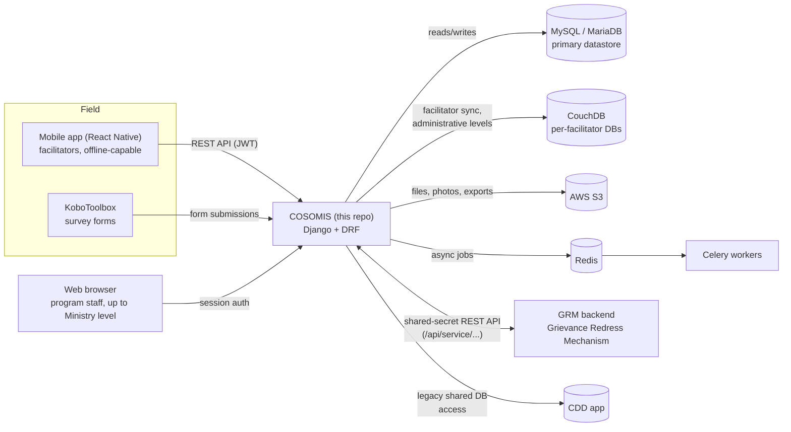
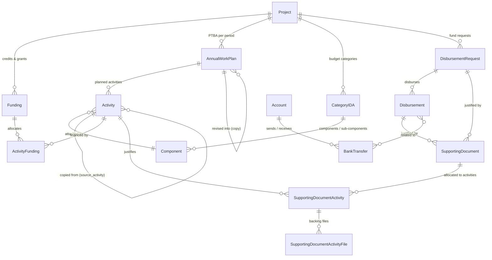

# COSOMIS

**COSOMIS** (the **M**anagement **I**nformation **S**ystem of the COSO program) is the
Django backend and web application used to plan, track and report on a World Bank
(IDA)-financed, community-driven development (CDD) program in Togo. It follows villages and
their infrastructure micro-projects from diagnostic through execution to hand-over, tracks the
administrative and budgetary hierarchy of the program (IDA credits/grants, annual work plans,
disbursements and bank transfers), and exposes role-based dashboards and reports for everyone
from field facilitators to the program's National Coordination and its Ministry oversight.

It is one of three sibling services operated for the program:

| Service | Role |
|---|---|
| **MIS** (this repository) | Program management: administrative hierarchy, sub-projects/infrastructure, financial & PTBA tracking, dashboards, reporting |
| **CDD** | Legacy application covering earlier community-driven-development workflows; MIS still reads/writes some shared data with it |
| **GRM** (`grm-backend`) | Grievance Redress Mechanism — citizen complaints ("issues") tied to administrative levels; MIS talks to it over a small inter-service REST API |

> Looking for the detailed data model and conventions of the `financial` module (disbursements,
> bank transfers, PTBA/activities)? See [`CLAUDE.md`](CLAUDE.md) — it is the living specification
> for that part of the app and should stay in sync with the code.

---

## Contents

- [Overview](#overview)
- [Key features](#key-features)
- [Architecture](#architecture)
  - [System context](#system-context)
  - [Django applications](#django-applications)
  - [Financial / PTBA domain model](#financial--ptba-domain-model)
- [Roles & permissions](#roles--permissions)
- [Internationalization](#internationalization)
- [Tech stack](#tech-stack)
- [Getting started](#getting-started)
- [Project structure](#project-structure)
- [Testing](#testing)
- [Deployment](#deployment)
- [Contributing](#contributing)

---

## Overview

Togo's administrative hierarchy — **Région → Préfecture → Commune → Canton → Village** — is
modeled directly in the app (`administrativelevels`), together with the **CVD** (*Comité
Villageois de Développement*), the elected village body through which communities choose,
co-finance and maintain their own infrastructure. Around that backbone, COSOMIS tracks:

- **Sub-projects / infrastructure** (schools, boreholes, rural tracks, electrification, market
  facilities...) chosen by communities, from diagnostic and technical/social studies through
  contracting, construction follow-up (technical, provisional and final acceptance), and
  post-completion maintenance funds.
- **IDA projects** (the program itself and its successive additional-financing phases — e.g.
  `COSO`, `FA-COSO`, `FA2-COSO`), each with its own credits/grants, annual work plans (PTBA),
  budget categories/components, fund requests, disbursements and justification of expenses.
- **Field operations**: facilitators assigned to territories, survey campaigns run in
  [KoboToolbox](https://www.kobotoolbox.org/) and synced in, and a mobile app (React Native,
  authenticating over the REST API with long-lived JWTs) used offline in the field.
- **Grievances**, handled by the sibling GRM service but surfaced/linked here against the same
  administrative levels.

The result is used by a wide chain of actors — from village facilitators up to the program's
Ministry-level leadership — each restricted to the data and actions relevant to their role (see
[Roles & permissions](#roles--permissions)).

## Key features

- **Administrative hierarchy & CVDs** — Region/Prefecture/Commune/Canton/Village tree, village
  development committees, geographic coordinates, per-level fund allocations.
- **Sub-project lifecycle tracking** — from village priorities and diagnostics through contracts,
  construction milestones, beneficiary counts (by gender/age) and maintenance funds, with
  file/photo attachments stored on S3.
- **Financial & PTBA tracking** (`financial` app) — IDA projects, credits/grants, budget
  categories/components, annual work plans and their activities, fund requests, disbursements,
  supporting-document justification, bank transfers between actors, account balances, and a
  fiduciary-situation dashboard. Includes spreadsheet-style bulk editors, Excel import/export, and
  a **PTBA revision/copy workflow** that freezes a historical snapshot of a plan before it's
  updated for a new period.
- **Field data collection** — KoboToolbox survey integration and a facilitator-to-territory
  assignment system, with offline-friendly sync via CouchDB.
- **Dashboards & reporting** — KPI dashboards (sub-projects by sector/step, disbursement and
  allocation summaries, wave progress...), Excel exports, and generated Word reports.
- **Grievance visibility** — inter-service calls to the GRM backend, secured with a shared secret.
- **Bilingual UI** (French/English, French by default) with a full audit history on every tracked
  model (who changed what, and when).
- **Role-based access** for 13 distinct roles, from field-level specialists to the Minister.

## Architecture

### System context



MIS is the hub: it owns the primary relational model (sub-projects, administrative levels,
financial data), talks to GRM over a small authenticated REST API instead of touching its
database directly, and still shares some legacy CouchDB-backed data with the older CDD
application while that migration completes.

### Django applications

The project is a single Django site (`cosomis/`) composed of focused apps:

| App | Responsibility |
|---|---|
| `usermanager` | Application users, API tokens, role/permission mixins used across the app |
| `authentication` | `Facilitator`, `GovernmentWorker` and the custom `User` model |
| `administrativelevels` | Region/Prefecture/Commune/Canton/Village hierarchy, CVDs, per-level fund allocations, GRM issue views |
| `subprojects` | Core CDD domain: IDA `Project`s, `Subproject`/infrastructure records, budget `Component`s, village diagnostics (priorities, obstacles, goals), file attachments |
| `financial` | IDA credits/grants, annual work plans (PTBA) & activities, fund requests, disbursements, bank transfers, account balances, dashboards & Excel import/export — see [below](#financial--ptba-domain-model) |
| `process_manager` | The post-login "select an IDA project" hub (`Wave`/`PeriodWave` campaign scheduling); the project chosen here scopes the rest of the session |
| `assignments` | Facilitator ↔ territory assignment |
| `kobotoolbox` | KoboToolbox form/submission integration |
| `dashboard` | Cross-cutting KPI dashboards and Excel exports |
| `reports` | Generated Word (.docx) reports |
| `attachments` / `custom_file` | File & photo upload/storage helpers (S3-backed) |
| `unicorn` | Reusable [django-unicorn](https://www.django-unicorn.com/) reactive components |

Cross-cutting building blocks live under `cosomis/` itself: `models_base.py` (the
`BaseModel`/`SoftDeleteMixin`/`ExternalIdMixin` every domain model builds on — automatic
created/updated-by history and soft delete), `middleware.py`, `settings.py`, and the root
`urls.py`/`urls_api.py`.

Every tracked model inherits a small set of mixins that give it, for free: soft delete (an
`is_deleted` flag instead of a real `DELETE`, so history is never lost), a JSON-encoded change
history (`users_involved`, surfaced as the "History" panel on most detail pages), and — where
relevant — an `external_id` used to make Excel re-imports idempotent.

### Financial / PTBA domain model

The `financial` app is the most actively developed part of the system. It reuses
`subprojects.Project` as the "IDA project" and `subprojects.Component`/`CategoryIDA` for the
budget category/component/sub-component hierarchy, and adds the rest of the disbursement and
work-planning model:



Notable design points, kept in sync with [`CLAUDE.md`](CLAUDE.md):

- **Aggregation rules are computed, not denormalized** — a category's amount, a plan's budgeted
  amount, an activity's justified amount and balance are all `@property` values derived on read,
  never stored fields to keep in sync.
- **A budget component or activity can be cumulative** — a parent counts its own amount *or* the
  sum of its children's, never both.
- **PTBA revision/copy** — copying a plan freezes an inactive, hidden-from-selection historical
  snapshot (with its own frozen "justified amount" / "balance to justify" captured at copy time)
  linked back to the still-active, renamed original, so a plan can be revised mid-period without
  losing its history.
- **Bank transfers** follow a strict 4-level hierarchy (Project → Regional office → Town hall →
  CVD → Service provider, with return transfers allowed), enforced in `BankTransfer.clean()`.

## Roles & permissions

Access is controlled with Django groups plus one `UserPassesTestMixin`-based view mixin per
role (`usermanager/permissions.py`). The program's full chain of actors is represented, from
field level up to ministerial oversight:

`SuperAdmin` (superuser) · `CDD Specialist` · `Admin` · `Evaluator` · `Accountant` ·
`Financial` · `Regional Coordinator` · `National Coordinator` · `General Manager` · `Director` ·
`Advisor` · `Minister` · `Infra`

Most write actions in the `financial` app are further restricted to `Accountant`/`Admin`/
`Evaluator` (day-to-day entry) or `Financial`/superuser (destructive actions), on top of the
group check above; `Admin` is accepted as a fallback by most of the other role checks too. After
logging in, every user first lands on `process_manager` to pick the IDA project they want to
work in for the session (`request.session['project_id']`); the rest of the app is scoped to that
choice.

## Internationalization

The UI is **French-first** (`LANGUAGE_CODE = 'fr'`), with English as a secondary language.
Every user-facing string is wrapped in `gettext_lazy`/``, and translations are
maintained by hand in `cosomis/locale/fr/LC_MESSAGES/django.po` (matching `msgid`/`msgstr` pairs
added alongside each change — see [`CLAUDE.md`](CLAUDE.md) for the exact convention) rather than
via `django-admin makemessages`. After editing the `.po` file, compile it with:

```bash
python manage.py compilemessages --locale fr
```

## Tech stack

| Layer | Choice |
|---|---|
| Language / framework | Python, Django 4.1 |
| API | Django REST Framework, `drf-spectacular` (OpenAPI schema), SimpleJWT |
| Primary database | MySQL / MariaDB |
| Secondary datastore | CouchDB (facilitator/offline sync, legacy administrative-level sharing) |
| File storage | AWS S3 (`django-storages`) |
| Async tasks | Celery + Redis (`django-celery-results`) |
| Server-side interactivity | `django-unicorn`, `django-htmx`, Bootstrap 4 (AdminLTE-based UI) |
| Data import/export | `pandas`, `openpyxl` (Excel), `python-docx` (Word reports) |
| Maps | Mapbox |
| App server | Gunicorn (see `Procfile`) |

## Getting started

### Prerequisites

- Python 3.9+ (matches the environment this app is developed against)
- MySQL/MariaDB server
- Redis (for Celery) and a CouchDB instance if you need facilitator-sync features
- An AWS S3 bucket (or S3-compatible storage) for file uploads

### Setup

```bash
git clone <this repository>
cd cosomis/cosomis        # the actual Django project root

python -m venv venv
source venv/bin/activate  # venv\Scripts\activate on Windows
pip install -r requirements.txt   # or requirements_dev.txt for local development

cp cosomis/dev.env cosomis/.env   # or create your own; see the variables below
python manage.py migrate
python manage.py compilemessages --locale fr
python manage.py createsuperuser
python manage.py runserver
```

Celery (only needed for background jobs, e.g. KoboToolbox sync tasks):

```bash
celery -A cosomis worker -l info
```

### Configuration

Settings are read from the environment via `django-environ`
(`cosomis/cosomis/settings.py`); example env files (`dev.env`, `local.env`, `prod.env`) live next
to it. Variable names to provide:

| Variable | Purpose |
|---|---|
| `DEBUG`, `ALLOWED_HOSTS` | Standard Django settings |
| `DATABASE_URL` | Primary MySQL/MariaDB connection |
| `LEGACY_DATABASE_URL` | Secondary connection to the legacy `cdd` database |
| `NO_SQL_USER`, `NO_SQL_PASS`, `NO_SQL_URL`, `COUCHDB_DATABASE_ADMINISTRATIVE_LEVEL` | CouchDB access for facilitator/administrative-level sync |
| `S3_BUCKET`, `S3_ACCESS`, `S3_SECRET`, `AWS_S3_REGION_NAME` | File storage |
| `MAPBOX_ACCESS_TOKEN`, `DIAGNOSTIC_MAP_LATITUDE`, `DIAGNOSTIC_MAP_LONGITUDE`, `DIAGNOSTIC_MAP_ZOOM`, `DIAGNOSTIC_MAP_WS_BOUND`, `DIAGNOSTIC_MAP_EN_BOUND`, `DIAGNOSTIC_MAP_ISO_CODE` | Map display defaults |
| `CDD_URL_BASE`, `MIS_URL_BASE`, `GRM_URL_BASE` | This program's service URLs (CORS/CSRF trusted origins, inter-service calls) |
| `GRM_SECRET_KEY_GENRATE` | Shared secret for the MIS ↔ GRM inter-service API |
| `TOKEN_ALLOWED_TO_ACCESS_API` | Comma-separated static tokens allowed to call select API endpoints |
| `KOBO_TOKEN`, `KOBO_TOKEN_V2` | KoboToolbox API access |
| `PURS_USER_DEV_EMAIL` | Default dev-user email used by some scripts |

Never commit real values for these — the tracked `dev.env`/`local.env`/`prod.env` files should
only ever hold non-production or locally-scoped secrets.

## Project structure

```
cosomis/                   # repo root
├── CLAUDE.md               # detailed spec/conventions for the financial/PTBA module
├── context/                 # reference workbooks/docs for that module
└── cosomis/                 # Django project root ("django-admin startproject" layout)
    ├── manage.py
    ├── cosomis/              # settings, root urls, shared base models/mixins, middleware
    ├── usermanager/ authentication/         # users, tokens, roles
    ├── administrativelevels/                # Region/Prefecture/Commune/Canton/Village, CVDs
    ├── subprojects/                         # IDA projects, sub-projects/infrastructure, components
    ├── financial/                           # PTBA, disbursements, bank transfers, dashboards
    ├── process_manager/                     # post-login project selector, campaign waves
    ├── assignments/                         # facilitator ↔ territory assignment
    ├── kobotoolbox/                         # survey integration
    ├── dashboard/ reports/                  # KPIs, Excel/Word outputs
    ├── attachments/ custom_file/            # file/photo storage helpers
    ├── unicorn/                             # django-unicorn components
    ├── locale/fr/LC_MESSAGES/django.po      # French translations (edited by hand)
    └── static/ media/                       # static assets / local media (S3 in production)
```

## Testing

Each app carries a `tests.py`, and Django's test runner works normally:

```bash
python manage.py test <app_name>
```

> The full `manage.py test` run currently fails for an unrelated, pre-existing reason (an
> `authentication_user_groups` FK issue in the test database setup). Until that's fixed, prefer
> running a single app's tests, or verify changes with ad-hoc scripts under a transaction that
> rolls back rather than relying on the full suite.

## Deployment

The app is served with Gunicorn (see `Procfile`):

```
gunicorn --workers 3 --threads 2 --timeout 600 --keep-alive 60 --bind 0.0.0.0:8000 cosomis.wsgi:application
```

A separate Celery worker process is required for background jobs. Static files are collected
with `python manage.py collectstatic`; uploaded media is served from S3 in any environment where
`DEBUG=False`.

## Contributing

- Keep the `financial`/PTBA module's behavior and [`CLAUDE.md`](CLAUDE.md) in sync — update the
  doc whenever you change that domain's model or rules.
- Every new user-facing string needs a matching `msgid`/`msgstr` pair added by hand to
  `cosomis/locale/fr/LC_MESSAGES/django.po` (see [Internationalization](#internationalization)) —
  don't defer it, and don't run `makemessages`.
- Domain models should inherit `BaseModel`/`SoftDeleteMixin` (`cosomis/models_base.py`) so they
  get history tracking and soft delete for free; prefer computed `@property` aggregates over
  denormalized fields, consistent with the rest of the `financial` app.
